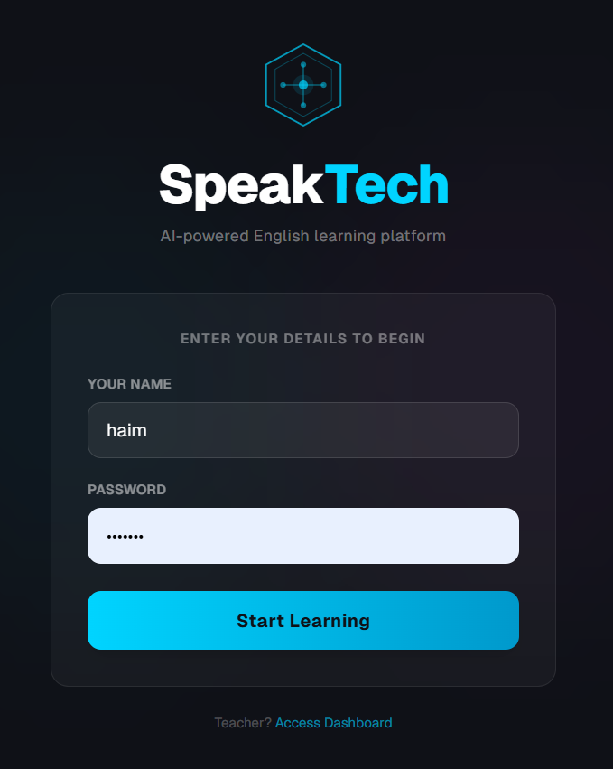
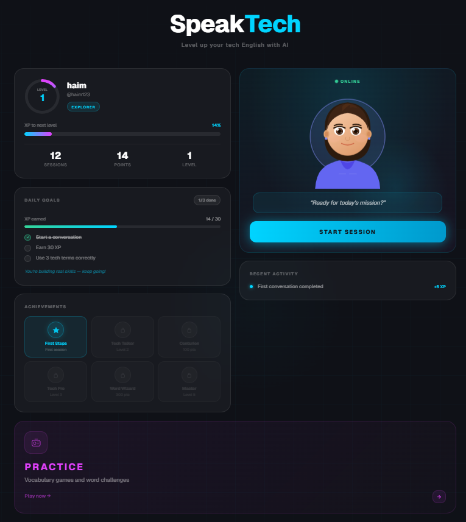
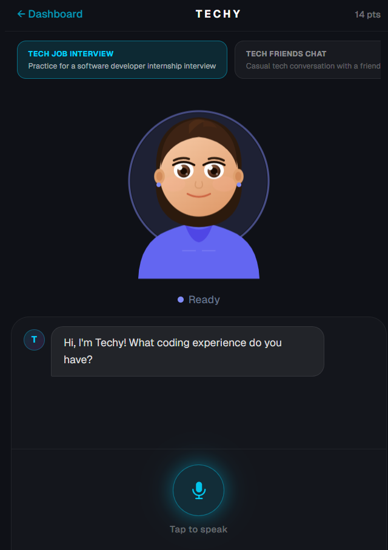
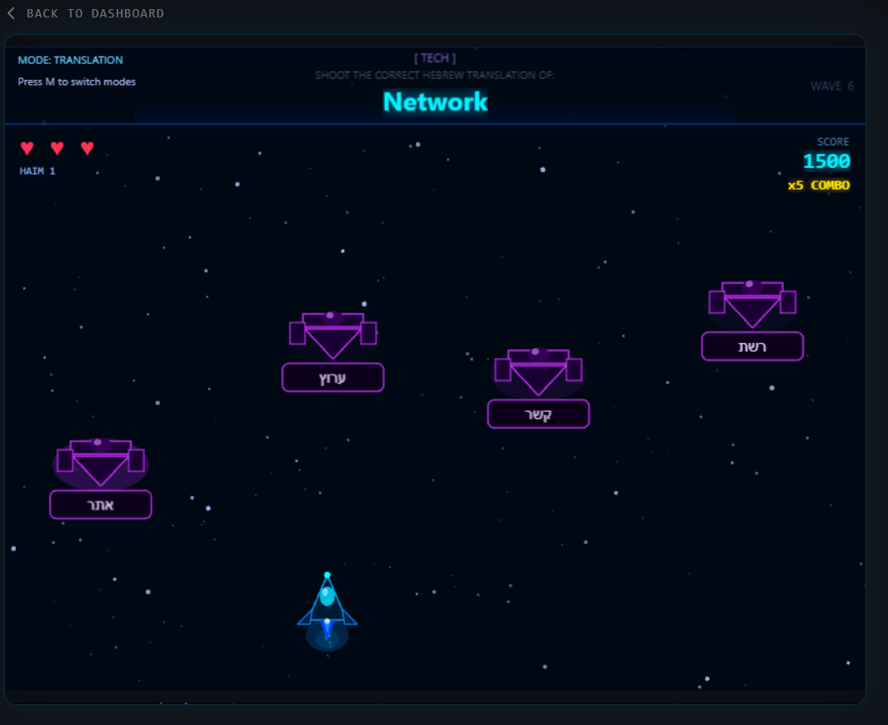
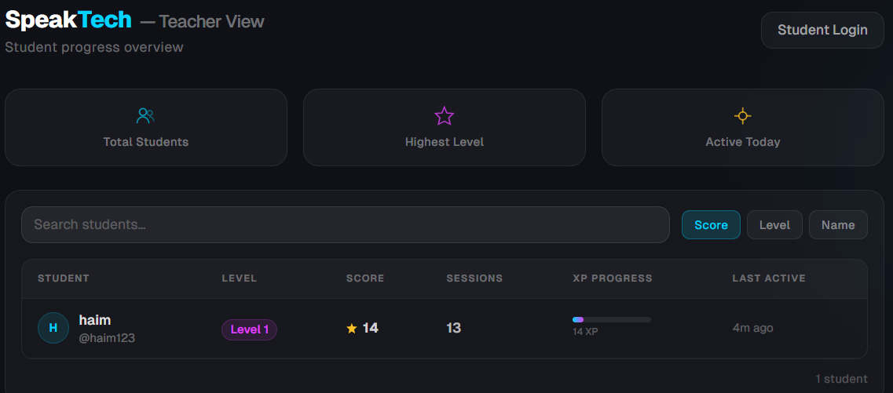
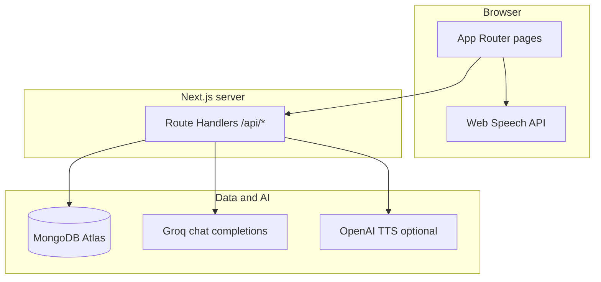

<h1 align="center">SpeakTech</h1>

<p align="center">
  <em>AI-powered spoken English for tech professionals — fluency, jargon, and confidence in one flow.</em>
</p>

<p align="center">
  <a href="https://nextjs.org/"></a>
  <a href="https://www.typescriptlang.org/"></a>
  <a href="https://tailwindcss.com/"></a>
  <a href="https://www.mongodb.com/atlas"></a>
</p>

<p align="center">
  <a href="https://groq.com/"></a>
  <a href="https://openai.com/"></a>
</p>

<p align="center">
  <a href="https://your-site-url.com">
    
  </a>
</p>

<br />

## Overview


**SpeakTech** is a full-stack MVP where learners practice **spoken English** in realistic tech scenarios. They meet **TECHY** — an AI tutor that speaks in character, gives structured **feedback** (corrections, suggestions, score), and adapts to **interview**, **friends**, and **workplace** modes.

The stack is intentionally modern and deployable: **Next.js App Router** for UI and **Route Handlers** for API, **MongoDB Atlas** for durable profiles and chat logs, **Groq** for fast JSON-mode chat, and the **Web Speech API** for zero-latency voice playback in the browser (with optional **OpenAI TTS** on the server for integrations that call `/api/tts`).

---

## Demo & media

> **Add your assets here** — replace the placeholders below with real screenshots or a short GIF to make the repo pop on GitHub.

<!-- SCREENSHOT: Student login / landing — suggested path: docs/images/login.png -->
<p align="center">
  
</p>

<p align="center">
  
</p>

<p align="center">
  
</p>

<p align="center">
  
</p>

<p align="center">
  
</p>

---

## Feature highlights

| Capability | What it does |
|------------|----------------|
| **AI Tech Tutor (TECHY)** | Scenario-based dialogue with JSON replies: `reply` + rich `feedback` (corrections, suggestions, score). |
| **Voice conversations** | Speech recognition for input; **Web Speech API** for reading replies aloud on the Tech experience. |
| **MongoDB persistence** | Students, chat sessions, and message rows — survives refresh and scales for demos. |
| **Tech vocabulary practice** | Phaser-powered **Galaxy** mode on `/practice` (embedded game bundle). |
| **Arcade game** | Separate Phaser build under `/game` for engagement loops. |
| **Teacher dashboard** | PIN-gated roster (`/teacher`) backed by the same student API. |
| **Real-time feel** | Streaming-ready route design; Groq for low-latency completions. |
| **Structured AI feedback** | Every turn can award XP on the client when score thresholds are met. |

---

## Tech stack

| Layer | Technology |
|-------|------------|
| **Framework** | Next.js 14 (App Router), React 18 |
| **Language** | TypeScript 5 |
| **Styling** | Tailwind CSS, Framer Motion |
| **Database** | MongoDB Atlas (`mongodb` official driver) |
| **Chat AI** | Groq API — `llama-3.3-70b-versatile` |
| **Server TTS (optional)** | OpenAI Audio API — `POST /api/tts` |
| **Client voice** | Web Speech API (`SpeechSynthesis` + recognition hooks) |
| **Game** | Phaser 3 |

**Not in this codebase:** Supabase, Clerk, Prisma, or custom auth middleware — identity is username + MongoDB for students; teacher access uses a simple env-based PIN (demo-grade).

---

## Architecture



**Request path (simplified):** the learner hits **Next.js pages** → **`/api/*` Route Handlers** → **MongoDB** for state and **Groq** for tutor turns (with optional **OpenAI** only when `/api/tts` is used).

---

## Project structure

```
speaktech/
├── app/                      # Routes, layouts, API handlers
│   ├── api/                  # students, sessions, chat, tts, test-db
│   ├── dashboard/            # Learner home
│   ├── tech/                 # TECHY tutor experience
│   ├── game/                 # Phaser arcade (components/game)
│   ├── practice/             # Phaser practice (features bundle)
│   ├── teacher/              # PIN-gated roster
│   └── page.tsx              # Landing / login flow
├── components/               # UI + Phaser canvas for /game
├── features/
│   └── speaktech-phaser/     # Phaser sources for /practice (+ optional Vite sub-app)
├── hooks/                    # useStudentSession, useVoiceInput, useTTS
├── lib/                      # mongodb, groq, openai (lazy TTS), scenarios, serializers
├── types/                    # Shared TS types (Student, Session, Feedback, …)
├── .env.example              # Copy → .env.local
├── package.json
└── README.md                 # You are here — single source of documentation
```

---

## Environment variables

**Single source of truth:** copy [`.env.example`](.env.example) to `.env.local` (recommended) or `.env`. Never commit real secrets — `.gitignore` excludes `.env` and `.env*.local`.

### Required (core demo)

| Variable | Purpose |
|----------|---------|
| `MONGODB_URI` | Atlas connection string. Needed for students, sessions, chat persistence, `GET /api/test-db`. |
| `GROQ_API_KEY` | Groq API key (typically `gsk_…`) for **`/api/chat`**. |

### Optional

| Variable | Default / behavior |
|----------|---------------------|
| `MONGODB_DB_NAME` | Defaults to **`speaktech`** if unset (`lib/mongodb.ts`). |
| `OPENAI_API_KEY` | Only if you call **`POST /api/tts`**. Lazy-loaded so `next build` works without it. The main TECHY UI uses **browser speech**, not this key. |
| `NEXT_PUBLIC_TEACHER_PIN` | Teacher gate on `/teacher`. Defaults to **`1234`**. **Not secret** — `NEXT_PUBLIC_*` is exposed in the client bundle. |

### Where variables are read

| File | Variables |
|------|-----------|
| `lib/mongodb.ts` | `MONGODB_URI`, `MONGODB_DB_NAME` |
| `lib/groq.ts` | `GROQ_API_KEY` |
| `lib/openai.ts` | `OPENAI_API_KEY` (on first `/api/tts` use) |
| `app/teacher/page.tsx` | `NEXT_PUBLIC_TEACHER_PIN` |

### Obtaining keys

| Key | Link |
|-----|------|
| MongoDB | [Atlas](https://cloud.mongodb.com/) → Connect → Drivers (whitelist IP for dev). |
| Groq | [console.groq.com/keys](https://console.groq.com/keys) |
| OpenAI (TTS only) | [platform.openai.com/api-keys](https://platform.openai.com/api-keys) |

### Common mistakes

1. Using an **OpenAI** key for **`GROQ_API_KEY`** — Groq will return 401.  
2. **Quotes** around values in `.env` — can break parsing; use `KEY=value` without extra quotes.  
3. Forgetting to **restart** `npm run dev` after env changes.  
4. Treating **`NEXT_PUBLIC_TEACHER_PIN`** as real security — it is demo obfuscation only.

---

## Installation

```bash
git clone <your-repo-url>
cd hackathon-english-platform   # or your folder name
npm install
cp .env.example .env.local      # Windows: copy .env.example .env.local
```

Edit **`.env.local`**: set at least **`MONGODB_URI`** and **`GROQ_API_KEY`**.

Optional: `GET http://localhost:3000/api/test-db` after Mongo is configured to verify connectivity.

---

## Running locally

```bash
npm run dev
```

Open **http://localhost:3000** — create a username, explore the dashboard, launch **TECHY** on `/tech`, practice on `/practice`, or review students on `/teacher` (PIN from env or default `1234`).

| Script | Description |
|--------|----------------|
| `npm run dev` | Development server |
| `npm run build` | Production build |
| `npm run start` | Serve production build |
| `npm run lint` | ESLint |

**Deploy:** Vercel or any Node host — set the same environment variables in the platform dashboard.

---

## AI system overview

| System | Implementation |
|--------|----------------|
| **Chat generation** | `app/api/chat/route.ts` → **Groq** `llama-3.3-70b-versatile`, `response_format: json_object`, same system prompts from `lib/scenarios.ts` for persona and JSON shape (`reply`, `feedback`). |
| **Persistence** | Non-blocking inserts into MongoDB **`messages`** when `studentId` + `sessionId` are present. |
| **TTS** | **`POST /api/tts`** uses **OpenAI** `tts-1` when `OPENAI_API_KEY` is set. Primary TECHY playback uses **`hooks/useTTS.ts`** → **Web Speech API** (no OpenAI key required for that path). |
| **Voice input** | `hooks/useVoiceInput.ts` + Web Speech Recognition where the browser supports it. |
| **XP / levels** | Client + `PATCH /api/students/[id]` with `xpDelta` after meaningful tutor scores. |

---

## Roadmap

- Persistent auth (OAuth / magic link) and multi-device profiles  
- Richer avatar / lip-sync or WebRTC “presence”  
- Multiplayer or cohort practice rooms  
- Automatic **pronunciation scoring** and replay drills  
- Analytics for teachers (time-on-task, scenario breakdown)  
- Pronunciation + prosody models wired to learner audio clips  

---

## Vision

SpeakTech exists to shrink the gap between **“I know my stack”** and **“I can explain it clearly in English.”** Technical skill is not enough in interviews, standups, and cross-border teams — **clarity and tone** matter. This MVP proves that a tight loop of **listen → speak → get structured AI feedback → level up** can live in a single deployable app, ready for judges, recruiters, and your next iteration.

---

## Credits & license

Built as a **hackathon-grade MVP** — swap in your team names and links here.

**License:** No `LICENSE` file is bundled yet; add one (e.g. MIT) before you want a clear open-source terms story.

---

<p align="center">
  <strong>SpeakTech</strong> — <em>Speak tech. Clearly.</em>
</p>
